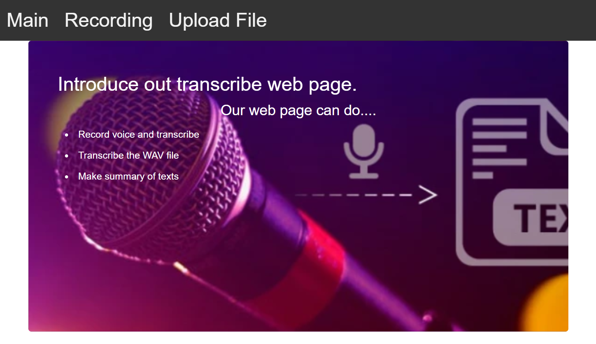

# 2020hackaton

First Website

**1.Installation**

pip install torch  
pip install bert-extractive-summarizer  
pip install spacy==2.1.3  
pip install transformers==2.2.2  
pip install neuralcoref  
pip install flask  
pip install pydub  
pip install SpeechRecognition  
pip install pocketsphinx 
The code is tested python 3.6

Supported Environment
Windows 10 64bit

**2. How to Use**
* python main.py
* Recording is realtime recording.
* Upload File
  Choose the wav file only.  
  Click the transcribe button

**3. Future work**
* Save button add
* Recording improvement  
* Various summarizer algorithm test

**4. Screen shot**

**5. License**
* MIT License
  
